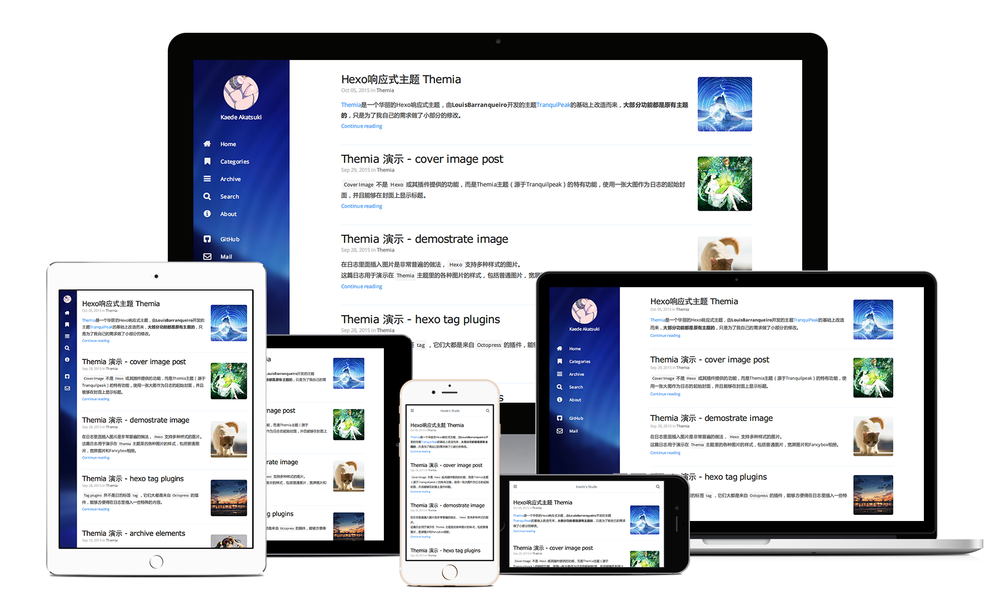

#### Hexo主题 Themia

**Themia** 是一个华丽的Hexo响应式主题，由 **LouisBarranqueiro** 开发的主题[TranquiPeak](https://github.com/LouisBarranqueiro/tranquilpeak-hexo-theme)的基础上改造而来，**大部分功能都是原有主题的**，只是为了我自己的需求做了小部分的修改，主要是针对中文适配做的修改。

#### 特点
 1. 增加1080P等大屏显示器下的SideBar样式；
 1. 调整文章的样式，比如字体、字体大小、对齐等；
 1. 中英混排自动加入空格（参考 [pangu.js](https://github.com/vinta/pangu.js)）；
 1. 同步更新至 TranquiPeak 1.7.1；

#### 使用
将本项目根目录的所有文件复制进一个文件夹，并把该文件夹复制进Hexo项目的themes目录下，再把Hexo的配置文件_config.yml中的theme标签的指改为该文件夹的名称即可。

如果你本地的HEXO无法直接使用该主题（cannot find module 'hexo-util' 之类的），请尝试进入该主题目录，安装以下依赖：
```shell
$ npm install
$ bower install
```

详细情况可以参考 Hexo响应式主题 Themia](http://kaedea.com/2015/10/05/themia-demo-using-thmia/)。

#### 预览
[我的博客](http://kaedea.com/)

#### 开发
如果你打算对Themia进行修改，请参考 [developer documentation](/docs/developer.md)。

#### License

Hexo-theme-themia & Tranquilpeak-hexo-theme is released under the terms of the [GNU General Public License v3.0](https://github.com/LouisBarranqueiro/tranquilpeak-hexo-theme/blob/master/LICENSE)
